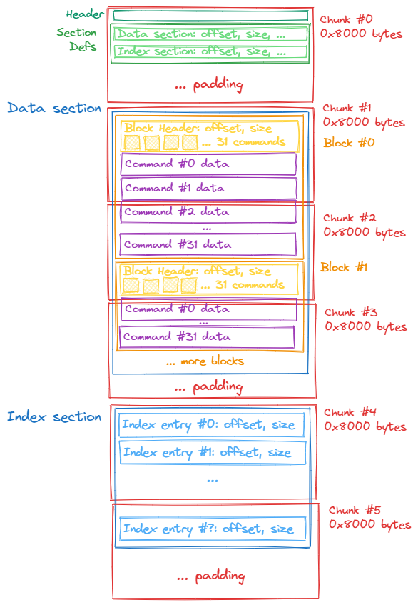

# The IPak file format

## IPak files

IPaks have the `.ipak` file extension and contain image data and are only used in Black Ops 2 (T6) and replace the usecase for IWD files there.

The image data contained is streamed just like with IWDs in other titles.
This means that the game keeps all loaded IPak files open and reads data for a corresponding image only on loading the given image.
Therefore not the entire content of the IPak is held in memory.
However on opening an IPak the index section is loaded and held in memory to be able to locate data for an image in an IPak.

Images in an IPak are not identified via name.
Instead the data for an image is located via a 64bit integer key.
It is built up from two 32bit integer keys.
The first one is a 32bit hash of the image name.
The second one is a CRC hash of the image data.

This means that image data is only from an IPak if both the name and the data (at least the specified hash) both match what was determined at runtime instead of only taking the image name as the way to locate the image data.
It is however to overwrite the data of an image anyway since the hash in the IPaks index section is trusted instead of calculating the hash at runtime.

Image data within IPaks can either be uncompressed, compressed or a mix of both.
Whenever data is compressed, the [LZO compression algorithm](https://en.wikipedia.org/wiki/Lempel–Ziv–Oberhumer) is used.
The game and most likely also the devs ipak creation tools use LZO Professional, which is an improved, more efficient version of the LZO compression.
However it is compatible with the LZO versions that are available as open source.

IPaks were most certainly designed with a focus on loading speed instead of file size.
Not unnoticable parts of the file are just padding data to move certain data to be located at specific size intervals, most likely for optimizing around some caching and IO implementations.
Also for compression LZO was chosen as an alternative to deflate which trades file size for decompression speed.

## The file structure

It is important to note that the available information about IPaks is limited, therefore some structures of the file were named by me since their official names are unknown.
So you might encounter code or other documentation that calls parts of the structure differently.
The terms within OAT should be consistent however.

The following image gives a rough overview over the structure of an IPak file.
Afterwards follows a detailed description over the different parts.

### Chunks

All data including the file header within IPaks are part of a chunk.
Chunks are data blocks of the size `0x8000` (`32768`) bytes, counted from the beginning of the file.
This means the file header is always contained in the first chunk which spans from `0` to excluding `0x8000`.
The second chunk goes from `0x8000` to excluding `0x10000` and so on.

The IPak file has to only contain full chunks meaning its file size must be a multiple of `0x8000` and the minimum size is `0x8000`.

Sections in an IPak can only be set on chunk level, meaning they have to start at the beginning of a chunk and end at the ending of a chunk.

The game's IPak reading code can only buffer up to `8` chunks within memory.
This means that no structure inside IPaks can be larger than `8` chunks (`0x8000 * 8` bytes -> `0x40000` bytes -> `262144` bytes).
This mostly applies for Blocks since they are the most likely to exceed this size.
All of these structures must be terminated before the `8` chunk size border.
If they exceed this size, the IPak is invalid.
If a structure starts inside a chunk and not at its beginning, the `8` chunk limited is counted from the beginning of the chunk it starts within.
Meaning its effective maximum size is lower at that point.

### IPak header

The IPak header is `16` bytes big:

| Name         | Size    |
| ------------ | ------- |
| magic        | 4 bytes |
| version      | 4 bytes |
| size         | 4 bytes |
| sectionCount | 4 bytes |

The `magic` must correspond to the char sequence "KAPI" (`0x4950414B`), so the reverse of "IPAK".

The `version` must always be `0x50000`.

The `size` field contains the total file size of the IPak.
The game ignores its value however.

The `sectionCount` field contains the amount of section definitions that now follow afterwards.

Vanilla IPaks will always have two sections: The data and the index section.
It is however possible to simply add additional sections.
The game's IPak reader ignores them if it does not know their type which is the case for anything other than data or index.

### Section definition

A single section definition is `16` bytes big:

| Name      | Size    |
| --------- | ------- |
| type      | 4 bytes |
| offset    | 4 bytes |
| size      | 4 bytes |
| itemCount | 4 bytes |

The `type` field contains the type of the section.
Depending on its value, the section is used for its appropriate purpose.
The game does know two section types, any sections with unknown types are ignored:

* `1` -> Index section
* `2` -> Data section

The `offset` field contains the file offset at which the section is located.

The `size` field contains the size of the section.

The `itemCount` field contains the amount of items that the section has.
Depending on the section type this can mean different things.
For data sections it states how many images the IPak has data for.
For index sections it states how many index entires the IPak has.
This value of this field is only used for index sections however.

### Sections

Sections inside IPak files are dedicated to a specific purpose.
A section must start at the beginning of a chunk.
Otherwise remaining space in between sections is padded with garbage data.

Since the first chunk is reserved for the file header and section definitions, the earliest (and most common) start for the first section is at the beginning of the second chunk.

The game only knows the data section and the index section.
Any other chunks are ignored.
Most commonly the first section in an IPak is the data section with the index section following afterwards.

#### The data section

The data section contains the data of the images contained within an IPak.
Its content is made up of Blocks.
Blocks do not have to have the same length, therefore the content does not follow a regular pattern in terms of size.
The data for an image must start at the beginning of a Block and must end at the end of the same or a subsequent block.

#### The index section

The index section contains metadata indexing the data within the data section.
Its content is an array of Index entries.

### Blocks

Blocks are only used within data sections.
They contain the data of the files within IPaks.
Blocks always start an offset that is a multiple of `0x80` (`128`), remaining space is padded with garbage data.

Any structure inside IPaks, most noticably Blocks, cannot span more than `8` chunks.
This means it is important that a Block terminates before this border is reached.
If it could otherwise exceed this point it must terminate early, meaning having less than its maximum amount of data and let the following Block handle further data.

A block starts with a header which is `128` bytes big:

| Name         | Size         |
| ------------ | ------------ |
| offset       | 3 bytes      |
| count        | 1 byte       |
| commands[31] | 31 * 4 bytes |

The `offset` field contains the offset inside the resulting file of the data that can be read from the block.
Meaning the first block for an image file should be the offset `0`.
If there are following Blocks for the same image file, they should continue at the offset where the data of the last Block ended.

The `count` field specifies how many commands the current Block makes use of.
This can at max be `31` due to there being `31` slots for commands.

The `commands` array holds `31` commands.
They dictate how to handle the data following the Block header.
A command is `4` bytes big:

| Name       | Size    |
| ---------- | ------- |
| size       | 3 bytes |
| compressed | 1 byte  |

The `size` field specifies how much data inside the IPak file should be handled as part of this command.
The data follows either the header when this is the first command of the Block, or the data of the previous command otherwise.

The `compressed` field specifies how the data of the command is handled.
The game handles the data as uncompressed image file data when this value is `0`.
If the value is `1`, the data is handled as LZO compressed image file data.
If this field has any other value, the command and its assigned data is ignored.

It is important that ignored commands are still skipped inside the file since the game uses the `compressed` value of `0xCF` to indicate skipped data for padding purposes.

As a sidenote:
OAT does understand this skipping of padding.
However it does refrain from using it mostly since there is technically no real reason for making use of it since the space otherwise used as padding could still be used for uncompressed data.

### Index entries

Index entries only occur in the index section.
They link an image file to its data in the data section.
This is done by specifying the Block in the data section at which the image data starts at.

Index entries are `16` bytes big:

| Name     | Size    |
| -------- | ------- |
| dataHash | 4 bytes |
| nameHash | 4 bytes |
| offset   | 4 bytes |
| size     | 4 bytes |

The `dataHash` field is a CRC32 checksum of the image file data.
For some reason the upper 3 bits of the hash are always set to 0 (`hash & 0x1FFFFFFF`).
I am not sure why.

The `nameHash` field is a hash of the image name, hashed with the game's `R_HashString` function.

The `offset` field specifies the offset of the first Block containing the image file data.
The offset is specifies relative to data section start, meaning the first Block within the data section would have offset `0`.

The `size` field specifies the amount of data inside the IPak that corresponds to this image file.
This includes Block headers, padding and everything.
This is **not** the size of the final image file.
